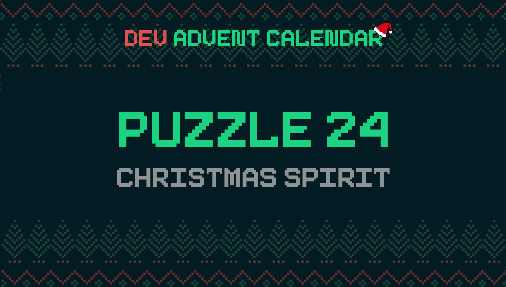

ℹ️ For detailed information about the contest, check out [devadvent/readme](https://github.com/devadvent/readme/)

# Dev Advent Calendar 🎅 Puzzle 24 - Christmas Spirit ✨

The _Christmas Spirit_ of developers all over the world has gone down, because they pushed to production on a Friday.

The thing is (and you might not know this) that the reindeers need a sufficient amount of _Christmas Spirit_ to actually fly.

It is YOUR job to bring back the spirit in the developers by writing a coding-related [Christmas carol](https://en.wikipedia.org/wiki/Christmas_carol).

## 💪 The challenge

Merry Christmas, and thanks for sticking around until the very end iof this advent calendar.
I want to personally thank you for participating 👏 There has flown a lot of work and energy into these challenges, and you make it completely worthwhile.

This challenges **does not involve any code**, rather than your creativity!

Write your most creative Christmas carol in the [christmas-carol.txt](christmas-carol.txt) file.

## 🚢 Ship your solution

Check out the [contributing guide](https://github.com/devadvent/readme/blob/main/CONTRIBUTING.md) for details about how to participate.

In short:

-   ✨ Create your repository by [acceping the assignment](https://classroom.github.com/a/xjwGT_if) using the participation link
-   🧩 Solve the puzzle
-   🐦 Add your Twitter handle to `twitter.js`
-   🤖 Test your solution
-   🚀 Upload your changes to the `main` branch

## 🔗 Participation link

In order to participate, you need to enter the following link and accept the assignment:
[https://classroom.github.com/a/xjwGT_if](https://classroom.github.com/a/xjwGT_if)

## 💻 Use this project

### ⏳ Install the dependencies

Install the dependencies with

```bash
yarn install
```

or

```bash
npm install
```

### ⚙️ Run the code

Run the code with

```bash
yarn dev
```

or

```bash
npm run dev
```

### 🤖 Test your solution

This puzzle is equipped with automated tests (in the `./tests` folder). In order for your solution to qualify for winning the daily prize, **all** tests need to pass.

To run these tests, execute one of the following commands in your console:

```bash
yarn test
```

or

```bash
npm test
```
